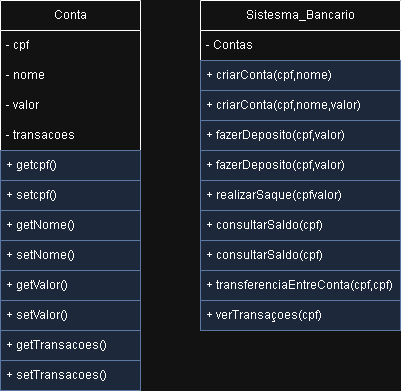

# 🏦 Simulador de Caixa Eletrônico

Aplicação de terminal feita em Java para simular um sistema bancário simples.

## 📄️ Lista de funcionalidades:

* Criar conta
* Fazer depósito
* Realizar saque
* Consultar saldo
* Transferência entre contas
* Ver extrato de transações

## 🪟 UML (Anexado)

## 🖥️ Código do Programa

## 🧪 Teste e Execução das funcionalidades:

* Criar conta
* Fazer depósito
* Realizar saque
* Consultar saldo
* Transferência entre contas
* Ver extrato de transações
