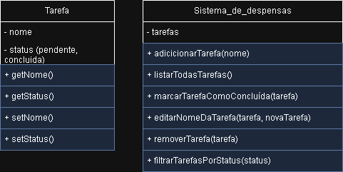

# ✅ Sistema de Gerenciamento de Tarefas

Sistema simples feito em Java para controlar tarefas do dia a dia.

## 📄️ Lista de funcionalidades:

- Adicionar nova tarefa
- Listar todas as tarefas
- Marcar tarefa como concluída
- Editar descrição da tarefa
- Remover tarefa
- Filtrar tarefas por status (pendente/concluída)

## 🪟 UML (Anexado)

- Começo: 09/04/24 18:14

- Término: 09/04/24 18:21

## 🖥️ Código do Programa

- Começo: 09/04/24 18:25

- Término: 09/04/24 19:15

Começo:

## 🧪 Teste e Execução das funcionalidades:

- Adicionar nova tarefa ✅
- Listar todas as tarefas ✅
- Marcar tarefa como concluída ✅
- Editar descrição da tarefa ✅
- Remover tarefa ✅
- Filtrar tarefas por status (pendente/concluída) ✅

- Começo: 09/04/24 19:15
- Término: 09/04/24 19:30

